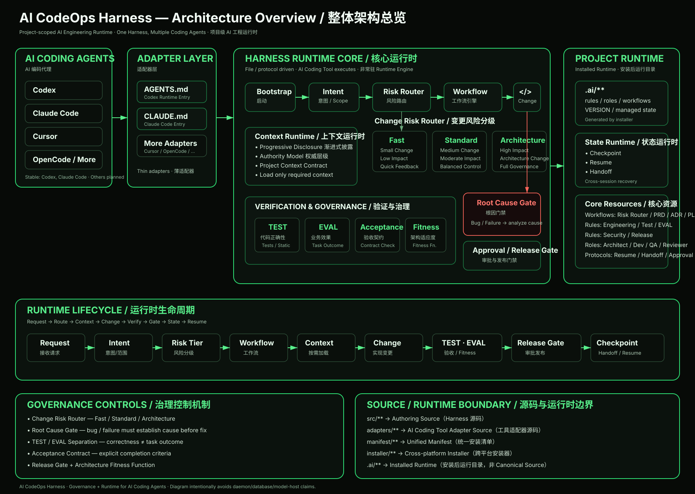
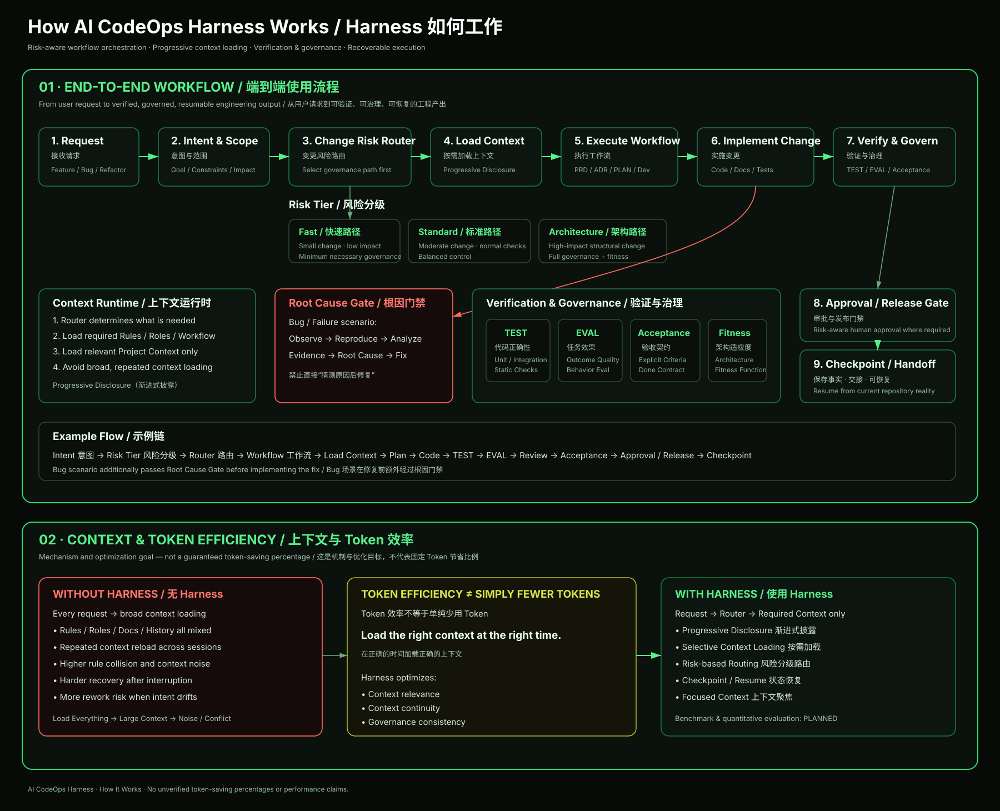

# AI CodeOps Harness

[简体中文](README.md) | English

**One Harness, Multiple Coding Agents.**

## 🏗️ Architecture Overview

<p align="center">
  
</p>

AI CodeOps Harness sits between the AI Coding Tool and the project, providing
unified engineering governance, context, workflows, recovery, and multi-tool
adapter capabilities.

AI CodeOps Harness is an engineering governance and runtime framework for AI
Coding Agents. It combines Engineering Governance, Context Engineering,
Workflow Routing, and Runtime Recovery into a reusable Harness rather than a
collection of standalone prompts.

The current implementation is a File / Protocol Driven Harness executed by an
AI Coding Tool. It is not a Resident Runtime Engine.

The Harness provides Bootstrap, Router, Resume Protocol, Progressive
Disclosure, Roles / Rules / Workflows, Checkpoints, Handoff, and AI Coding
Tool Adapters. SDD, TDD, and SDD + TDD are Development Methods / Workflows the
Harness can carry; they are not synonyms for the Harness itself.

Runtime Model: [`docs/harness/RUNTIME-MODEL.md`](docs/harness/RUNTIME-MODEL.md)

## Architecture

```text
Developer
   │
   ▼
AI Coding Tool
Codex / Claude Code / ...
   │
   ▼
Adapter Layer
   │
   ▼
Bootstrap / Router / Resume
   │
   ▼
AI CodeOps Harness
├── Rules
├── Roles
├── Workflows
├── Context
├── Recovery
└── Handoff
   │
   ▼
Development Workflow
├── PRD
├── ADR
├── PLAN
├── SDD (planned workflow)
├── TDD (planned workflow)
└── SDD + TDD (planned workflow)
   │
   ▼
Project Code / Tests / Docs
```

SDD/TDD workflows are currently planned and are not presented as implemented.

## Source / Runtime Architecture

```text
ai-codeops-harness
├── src/          Harness Authoring Source
├── adapters/     AI Tool Adapter Source
├── manifest/     Unified Installation Manifest
├── installer/    Cross-platform Installers
└── docs/         Contracts / Architecture
```

After installation into a target project:

```text
user-project/
├── AGENTS.md
├── CLAUDE.md                 # installed when claude-code is selected
└── .ai/
    ├── rules/
    ├── roles/
    ├── workflows/
    ├── state/
    │   ├── approvals/
    │   └── checkpoints/
    │       └── tasks/
    └── VERSION
```

`src/**` → `.ai/**`. The Source Repository and Installed Runtime are separate.
Installation mappings are defined by the single
`manifest/harness.yaml`; user files and Project Context in an adopting project
are not part of this source repository.

## 🚀 How It Works

<p align="center">
  
</p>

> **About token efficiency:** Harness uses progressive disclosure, selective context loading, and checkpoint/resume to reduce irrelevant context and repeated recovery overhead. This describes the design mechanism and optimization goal rather than a guaranteed token-saving percentage; quantitative benchmarking is still planned.

## Installation

Installation is currently project-scoped: the Installer writes to a selected
target project and refuses to install into the Harness source repository.

### macOS / Linux

```bash
git clone https://github.com/AlanHuang168/ai-codeops-harness.git
cd your-project
/path/to/ai-codeops-harness/installer/install.sh --target . --adapter codex
```

Omit `--target` to use the current directory. One `--adapter` option accepts
multiple adapter names:

```bash
/path/to/ai-codeops-harness/installer/install.sh \
  --target /path/to/your-project \
  --adapter codex claude-code
```

Repeated `--adapter` options remain supported for compatibility.

### Windows PowerShell

```powershell
git clone https://github.com/AlanHuang168/ai-codeops-harness.git
Set-Location your-project
& ..\ai-codeops-harness\installer\install.ps1 -Target . -Adapter codex
```

Select multiple adapters with a comma-separated value:

```powershell
& ..\ai-codeops-harness\installer\install.ps1 `
  -Target . `
  -Adapter codex,claude-code
```

Both installers share the Manifest, mappings, Adapter Registry, ownership,
SHA-256 rules, and exit-code semantics. Only first installation is implemented;
update, uninstall, backup, merge, and the broader distribution workflow are
not implemented yet.

## Minimal Usage Flow

1. Get `ai-codeops-harness`.
2. Run the Installer in the target project.
3. Select one or more AI Coding Tool Adapters.
4. Generate `.ai/**` and the selected entry files.
5. Enter the project with Codex or Claude Code.
6. Adapter → Bootstrap → Router → Harness Workflow.

## Supported Tools

| Tool / Agent Runtime | Status |
| --- | --- |
| Codex | Stable |
| Claude Code | Stable |
| Cursor | Planned |
| OpenCode | Planned |
| Gemini CLI | Planned |
| Qwen Code | Planned |
| TRAE | Planned |
| Generic AGENTS | Planned |

An Adapter targets an AI Coding Tool / Agent Runtime, not an underlying model.
GPT, Claude, Gemini, Qwen, DeepSeek, and other models do not receive separate
Harness Adapters.

## Core Concepts

- **Bootstrap**: enters the Harness through a tool adapter and establishes the minimum context.
- **Router**: selects the safest Workflow stage from requirements, architecture, plan, and implementation state.
- **Change Risk Router**: classifies a change into Fast / Standard / Architecture paths first, deciding the strength of the Root Cause Gate, EVAL, Acceptance Contract, and Release Gate, then hands off to the Router for stage selection.
- **Root Cause Gate**: a bug fix must state Symptom → Root Cause → Why tests missed it → Fix Strategy → Regression Protection before any high-impact change.
- **TEST / EVAL Separation**: TEST verifies code and contracts; EVAL verifies business effect. Parser / algorithm / AI / rule-engine / recommendation changes must run the regression dataset; `pytest passed` alone is not proof of business correctness.
- **Architecture Fitness Function**: an Accepted ADR produces verifiable architecture constraints that run during the Architecture Path Verify step; a FAIL is Architecture Drift, preventing architecture from eroding over time.
- **Acceptance Contract**: every task declares Technical + Business acceptance items that Review must verify before passing.
- **Release Gate**: deployable projects separate Code Done from Delivery Done, checking README, health check, deployment, upgrade, rollback, smoke test, and runtime config.
- **Resume Protocol**: recovers interrupted work from State, Checkpoints, and Current Reality.
- **Continuous PLAN Execution**: continues READY Tasks after one PLAN approval until completion or a real Human Gate.
- **Human Gate**: handles architecture, scope, risk, destructive actions, and explicit decisions; Task completion is not a gate.
- **Machine-Readable Approval**: persists Human Approval as a Runtime Fact under `.ai/state/approvals/`.
- **Historical Reconciliation**: reconciles old Checkpoints before Resume so resolved or superseded work is not reactivated.
- **Authority Model**: separates Harness rules, protocols, Project Context, and Runtime Facts.
- **Progressive Disclosure**: loads only the context required for the current task.
- **Runtime Recovery**: enables low-cost continuation after Session, AI, or Token-limit interruption.
- **Checkpoint**: stores structured recovery facts and a Reality Anchor per Task.
- **Handoff**: provides a non-authoritative summary for people and other AIs; it does not replace State or Project Context.

## SDD / TDD and the Harness

Harness = Governance / Runtime Layer.

- SDD = Spec-Driven Development.
- TDD = Test-Driven Development.

The Harness may eventually carry this flow:

```text
Requirement → Spec → Design → Task → RED → GREEN → REFACTOR → Verification → Handoff
```

The repository does not currently contain formal `sdd.md` or `tdd.md`
workflows, so this capability is planned.

## Safety / Governance

- Installation paths are project-relative.
- `.ai/VERSION` records managed-file facts with SHA-256.
- Ownership distinguishes Harness-owned, Adapter-owned, User-owned, and Generated runtime content.
- User-modified or unknown files are protected by default; there is no silent overwrite.
- Unknown user files under `.ai/**` are preserved.
- macOS/Linux and Windows share one Manifest and one Core mapping policy.

See [`docs/harness/INSTALLER-CONTRACT.md`](docs/harness/INSTALLER-CONTRACT.md)
for the complete behavior contract.

## 🗺️ Roadmap

The roadmap reflects the current development direction and is not a fixed delivery commitment. It may evolve based on real-world usage and community feedback.

### ✅ Available

- Harness Core
- Source / Runtime Separation
- Runtime Model
- Codex Adapter
- Claude Code Adapter
- Change Risk Router (Fast / Standard / Architecture)
- Root Cause Gate / TEST · EVAL Separation / Acceptance Contract
- Release / Deployment Definition of Done
- Unified Manifest
- Installer Contract
- macOS / Linux Installer
- PowerShell Installer

### 🚧 Planned

- Native Windows Verification
- Runtime Lifecycle Improvements
- Safe Update / Upgrade
- Backup & Rollback
- Uninstall
- More Coding Agent Adapters
- SDD / TDD / SDD+TDD Workflows
- Benchmark & Context Efficiency Evaluation
- Release Distribution

## Status

Early release: `v0.1.0`.

V0.1 first-install paths are available; the broader installation/distribution workflow is not implemented yet.
