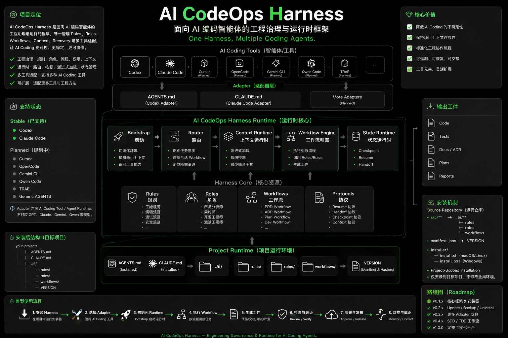
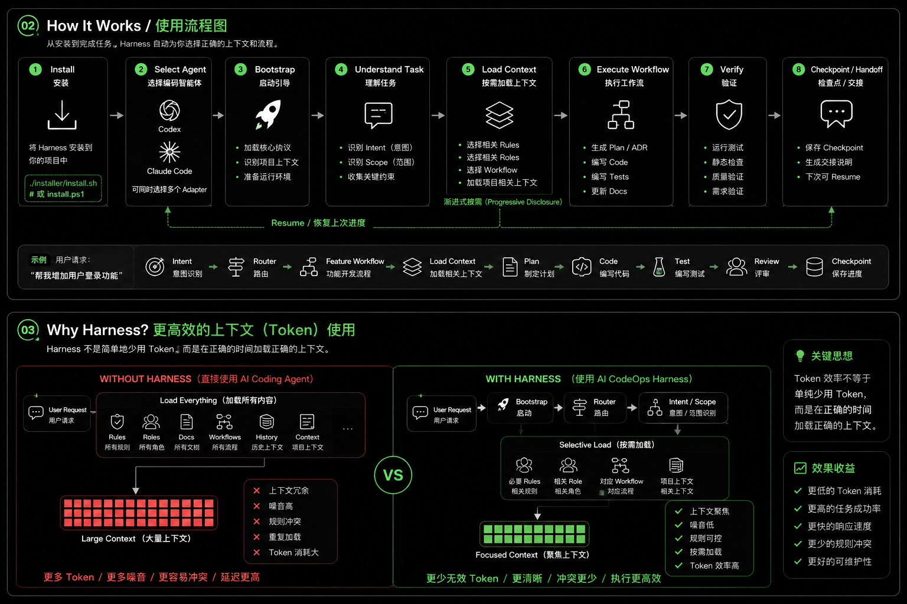
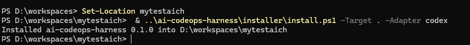

# AI CodeOps Harness

简体中文 | [English](README.en.md)

**One Harness, Multiple Coding Agents.**

## 🏗️ 整体架构

<p align="center">
  
</p>

AI CodeOps Harness 位于 AI Coding Tool 与项目工程之间，提供统一的工程治理、上下文、工作流、恢复和多工具适配能力。

AI CodeOps Harness 是面向 AI Coding Agent 的工程治理与运行时框架。它把
Engineering Governance（工程治理）、Context Engineering（上下文工程）、
Workflow Routing（工作流路由）和 Runtime Recovery（运行时恢复）组织成一套
可复用的 Harness，而不是一组孤立的 Prompt。

Harness 提供 Bootstrap、Router、Resume Protocol（恢复协议）、Progressive
Disclosure（渐进式披露）、Role / Rule / Workflow、Checkpoint（检查点）、
Handoff（交接）以及 AI Coding Tool Adapter（AI 编程工具适配器）。SDD、TDD
或 SDD + TDD 是 Harness 可以承载的 Development Method / Workflow（开发方法/工作流），
不是 Harness 本身的同义词。

Runtime Model（运行时模型）：[`docs/harness/RUNTIME-MODEL.md`](docs/harness/RUNTIME-MODEL.md)

## 项目骨架

```text
Developer
   │
   ▼
AI Coding Tool
Codex / Claude Code / ...
   │
   ▼
Adapter Layer
   │
   ▼
Bootstrap / Router / Resume
   │
   ▼
AI CodeOps Harness
├── Rules
├── Roles
├── Workflows
├── Context
├── Recovery
└── Handoff
   │
   ▼
Development Workflow
├── PRD
├── ADR
├── PLAN
├── SDD（未实现）
├── TDD（未实现）
└── SDD + TDD（未实现）
   │
   ▼
Project Code / Tests / Docs
```

SDD/TDD 工作流目前尚未实现，不代表已经可用。

## Source / Runtime 架构

```text
ai-codeops-harness
├── src/          Harness Authoring Source
├── adapters/     AI Tool Adapter Source
├── manifest/     Unified Installation Manifest
├── installer/    Cross-platform Installers
└── docs/         Contracts / Architecture
```

安装到目标项目后：

```text
user-project/
├── AGENTS.md
├── CLAUDE.md
└── .ai/
    ├── rules/
    ├── roles/
    ├── workflows/
    └── VERSION
```

`src/**` → `.ai/**`。Source Repository 与 Installed Runtime（安装后运行时）分离。
安装映射由 `manifest/harness.yaml` 统一定义；目标项目中的用户文件和 Project
Context（项目上下文）不属于本仓库源码。

## 🚀 Harness 如何工作？

<p align="center">
  
</p>

> **关于 Token 效率：** Harness 通过 Progressive Disclosure（渐进式披露）和按需上下文加载减少无关 Context 的重复加载。当前描述表达的是设计机制和优化目标，并非固定比例的 Token 节省承诺；后续将通过 Benchmark 提供量化数据。

## 安装

当前是 project-scoped installation（项目级安装）：Installer 写入指定目标项目，
不会安装到 Harness 源码仓库本身。

### macOS / Linux

```bash
git clone https://github.com/AlanHuang168/ai-codeops-harness.git
cd your-project
/path/to/ai-codeops-harness/installer/install.sh --target . --adapter codex
```

不指定 `--target` 时使用当前目录。可重复指定 Adapter：

```bash
/path/to/ai-codeops-harness/installer/install.sh \
  --target /path/to/your-project \
  --adapter codex \
  --adapter claude-code
```

### Windows PowerShell

```powershell
git clone https://github.com/AlanHuang168/ai-codeops-harness.git
Set-Location your-project
& ..\ai-codeops-harness\installer\install.ps1 -Target . -Adapter codex
```
<p align="center">
  
</p>
多选 Adapter：

```powershell
& ..\ai-codeops-harness\installer\install.ps1 `
  -Target . `
  -Adapter codex,claude-code
```

两个 Installer 共享 Manifest、mapping、Adapter Registry、ownership、SHA-256
和退出码语义。当前仅实现首次安装；update、uninstall、backup、merge 和完整
distribution workflow（分发工作流）尚未实现。

## 最小使用流程

1. 获取 `ai-codeops-harness`。
2. 在目标项目运行 Installer。
3. 选择一个或多个 AI Coding Tool Adapter。
4. Installer 生成 `.ai/**` 与选定的入口文件。
5. 使用 Codex 或 Claude Code 进入目标项目。
6. Adapter → Bootstrap → Router → Harness Workflow。

## 支持的工具

| Tool / Agent Runtime | 状态 |
| --- | --- |
| Codex | 稳定 |
| Claude Code | 稳定 |
| Cursor | 未实现 |
| OpenCode | 未实现 |
| Gemini CLI | 未实现 |
| Qwen Code | 未实现 |
| TRAE | 未实现 |
| Generic AGENTS | 未实现 |

Adapter 对应 AI Coding Tool / Agent Runtime，不对应底层模型。GPT、Claude、Gemini、
Qwen、DeepSeek 等模型不会单独建立 Harness Adapter。

## 核心概念

- **Bootstrap（启动）**：从工具入口进入 Harness，建立最小执行上下文。
- **Router（路由）**：根据需求、架构、计划和实现状态选择安全 Workflow 阶段。
- **Resume Protocol（恢复协议）**：从 State、Checkpoint 和 Current Reality 恢复中断任务。
- **Authority Model（权威模型）**：区分 Harness 规则、协议、Project Context 和 Runtime Facts。
- **Progressive Disclosure（渐进式披露）**：只加载完成当前任务所需的最小上下文。
- **Runtime Recovery（运行时恢复）**：在 Session、AI 或 Token 限额中断后低成本继续执行。
- **Checkpoint（检查点）**：按 Task 保存恢复所需的结构化事实和 Reality Anchor（事实锚点）。
- **Handoff（交接）**：面向人和其他 AI 的非权威摘要，不替代 State 或 Project Context。

## SDD / TDD 与 Harness

Harness = Governance / Runtime Layer（治理/运行时层）。

- SDD = Spec-Driven Development（规格驱动开发）。
- TDD = Test-Driven Development（测试驱动开发）。

未来可以承载以下流程：

```text
Requirement → Spec → Design → Task → RED → GREEN → REFACTOR → Verification → Handoff
```

当前仓库尚无正式 `sdd.md` / `tdd.md` 工作流，因此该能力尚未实现。

## 安全与治理

- 所有安装路径使用 project-relative path（项目相对路径）。
- `.ai/VERSION` 使用 managed file SHA-256 记录文件事实。
- Ownership（所有权）区分 Harness-owned、Adapter-owned、User-owned 和 Generated runtime。
- 用户修改或未知归属的文件默认冲突保护，不静默覆盖。
- 未知 `.ai/**` 用户文件保留。
- macOS/Linux 与 Windows 共用同一份 Manifest，不维护两套 Core 映射规则。

完整行为契约见 [`docs/harness/INSTALLER-CONTRACT.md`](docs/harness/INSTALLER-CONTRACT.md)。

## 🗺️ 路线图

路线图表示当前规划方向，并非固定交付承诺，后续可能根据实际使用反馈和社区需求调整。

### ✅ 已完成

- Harness Core
- Source / Runtime separation
- Runtime Model
- Codex Adapter
- Claude Code Adapter
- Unified Manifest
- Installer Contract
- macOS / Linux Installer
- PowerShell Installer

### 🚧 规划中

- Native Windows verification
- Runtime lifecycle improvements
- Safe Update / Upgrade（安全更新 / 升级）
- Backup & Rollback（备份与回滚）
- Uninstall
- More Coding Agent Adapters
- SDD / TDD / SDD+TDD Workflows
- Benchmark & Context Efficiency Evaluation（基准测试与上下文效率评估）
- Release Distribution

## 当前状态

Early release: `v0.1.0`。

V0.1 first-install paths are available; the broader installation/distribution workflow is not implemented yet.
